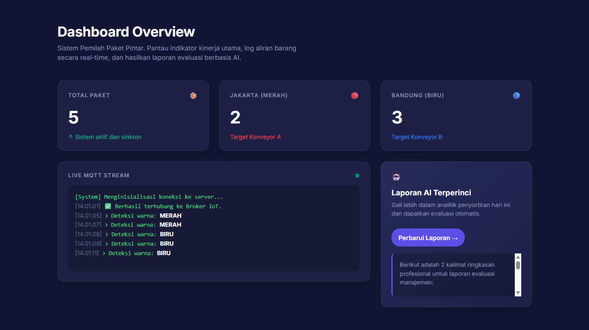
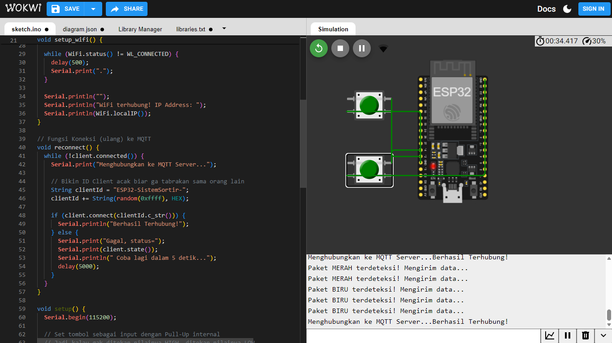

# 📦 IoT AI Smart Sorter

## 📝 Deskripsi Proyek
Sistem penyortir barang otomatis berbasis Internet of Things (IoT) dan Artificial Intelligence (AI). Proyek ini menggunakan kamera untuk mendeteksi warna barang (Merah/Biru), kemudian AI (Google Gemini) akan memberikan instruksi via jaringan nirkabel ke mikrokontroler untuk menggerakkan motor servo sebagai palang penyortir jalur.

**Status Proyek:** 🟢 *Software & Architecture (Wokwi Simulated)*

## 🧪 Simulasi Wokwi (Cara Menjalankan)
Jika ingin menjalankan logika mikrokontroler pada simulator Wokwi, pastikan untuk memasukkan daftar library berikut ke dalam tab `libraries.txt`:
```text
PubSubClient
ESP32Servo
ArduinoJson
```

## 🚀 Screenshot & Video Simulasi

| 🖥️ UI Web Dashboard | ⚙️ Rangkaian Simulasi Wokwi |
| :---: | :---: |
|  |  |

🎥 **Video Simulasi Lengkap:** [Klik untuk menonton via Google Drive](https://drive.google.com/file/d/1n1Aszi8HVjRU81Ul7qsA-nDYel2LyhNS/view?usp=sharing)

---

## 🛠️ Tech Stack & Komponen
* **Komunikasi Data:** MQTT Protocol (PubSubClient)
* **Kecerdasan Buatan:** Google Gemini AI API
* **User Interface:** Web Dashboard (HTML, CSS, Vanilla JS)

---

## ⚙️ Cara Kerja Sistem (Arsitektur)
1. **Trigger/Deteksi:** Web Dashboard mengirimkan simulasi data warna, atau Kamera menangkap visual barang.
2. **Pemrosesan AI:** Sistem meminta Gemini AI untuk mengklasifikasikan warna barang tersebut secara akurat.
3. **Komunikasi MQTT:** Keputusan dari AI dipublikasikan (*Publish*) ke MQTT Broker publik.
4. **Eksekusi Mekanik:** Mikrokontroler ESP32 yang terus mendengarkan (*Subscribe*) *topic* MQTT akan menerima perintah tersebut, lalu menggerakkan Motor Servo ke sudut yang telah ditentukan (Jalur Kiri atau Jalur Kanan).
5. **Real-time Monitoring:** Web Dashboard menampilkan status pergerakan alat dan *log* data secara *real-time*.

---

## 📂 Struktur Repository
Repository ini menggunakan sistem *Monorepo* yang menampung seluruh ekosistem proyek:
* `website/` - Berisi *source code* untuk UI/UX Dashboard interaktif.
* `esp32_sorter_mqtt/` - Berisi *source code* C++ (`.ino`) untuk logika mikrokontroler dan integrasi alat penggerak.

---
*Dikembangkan oleh: Kelompok 5*
---

Nama : Zaid Firdaus Chaniago
Nim : 23552011023

Nama : Arya Maulana Yusuf
Nim : 23552011383

Nama : Nazwa Naila
Nim : 23552011389
